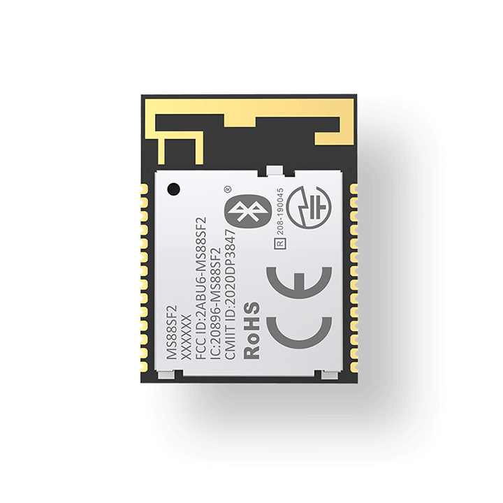

.. _ms88sf2_nrf52840:

MS88SF2 IoT Board
#################

Overview
********

The MS88SF21 module is an advanced, compact size, highly flexible, 
ultra-low power wireless Bluetooth® LE 5.0/5.1 Module based on Nordic 
nRF52840/52833 SoC with an optimized and complete radio design of 2 types of 
antenna available：PCB antenna or u.FL(IPEX) connector for external antenna. 
MS88SF2 series brings out all nRF52840/nRF52833 hardware features and capabilities 
including USB access, up to +8 dBm transmit power up to 5.5V supply considerations, 
and 802.15.4 (Thread/Zigbee) implementation, Bluetooth 5 Long Range Feature and 
advanced security capabilities.

Hardware
********

Product Variants:	                         MS88SF21-1Y40AIR
PCB Antenna:	                             √
Chip Inside:	                             nRF52840
Bluetooth Qualification:                     v5.0(Bluetooth Low Energy)
Bluetooth low Energy Output Power EIRP[dBm]: 8
Maximum Range [m]:                           800
Maximum Number Of Connections:               8
Standalone Module Open CPU:	                 √
UART:	                                     2
SPl:	                                     7
TwI (2C compatible):                         2
GPIO:	                                     48
ADC:	                                     4
PWM:	                                     16
Minimum Supply [M]:	                         1.7
Maximum Supply [M]:	                         5.5
Maximum Temperature [C]:                     85
Minimum Temperature [C]:                     -40
Size [mm]:                                   23.2*17.4*2mm

References
**********

.. target-notes::

.. _MS88SF2 website: https://www.minew.com/product/nrf52840-ms88sf21

